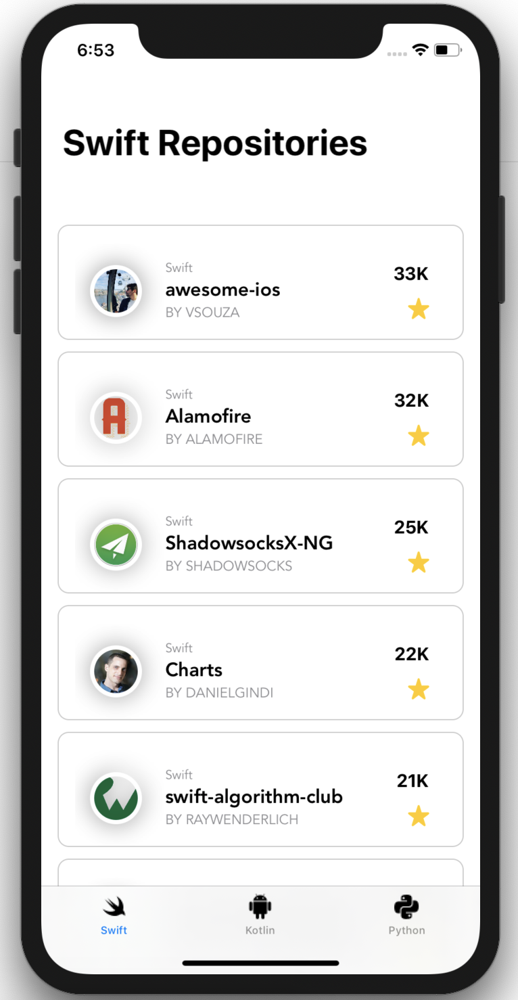

# StarredGitRepositories
<p align="left">
    
    
    <a href="https://cocoapods.org">
        
    </a>
    
</p>

**StarredGitRepositories** is an application for the iOS platform that uses the GitHub API to list the most starred repositories of three programming languages: Swift, Kotlin and Python.

<p align="center">
    
</p>

## Installation
To clone and run this project locally, please execute the following commands:
```
$ git clone https://github.com/victoroka/StarredGitRepositories.git
$ cd StarredGitRepositories
$ pod install
```

## Libraries
The project was built with the Apple's brand new framework **SwiftUI**, a **native** user interface toolkit that lets us design apps in a declarative way. And for testing, it was used the following third-party dependencies managed by **CocoaPods**:
- **Quick**: The Swift (and Objective-C) testing framework, mainly used for BDD (behavior-driven development) tests.
- **Nimble**: A Matcher Framework for Swift and Objective-C that allows you to express expectations using a natural, easily understood language.

